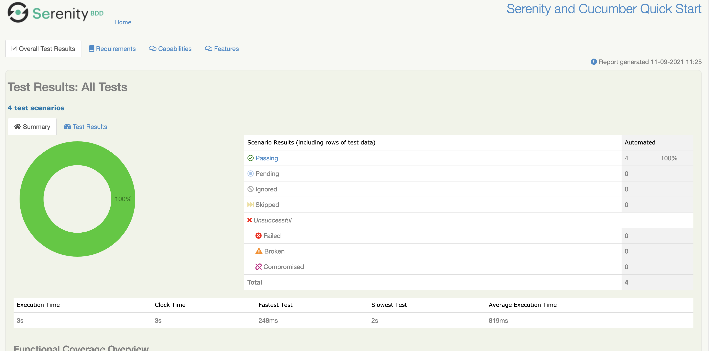

# FEDEX QA ENGINEER ASSESSMENT

[Sources][GitHub] | [System under test][SATLink] |

## Tech info

The test solution is build with Java, Maven and [Serenity](https://serenity-bdd.github.io/) 

## Test description

This solution contains tests for FedEx [Home Page](https://www.fedex.com/en-gb/home.html): 
1. Localization tests 
2. Tests for Rate & Transit functionality 
3. Login and Registration navigation 

## How to run the tests

Tests can be executed in an IDE of choice (we prefer Intellij IDEA)

You can execute tests individually from feature files or run all of them by executing `mvn verify`
from IDE terminal

After any test execution you can find report in: `target/site/serenity/index.html`

### Prerequisites

#### Windows

Installation using [chocolatey](https://chocolatey.org/install#installing-chocolatey) and [scoop](https://scoop.sh/):

* Java: `choco install jdk11`
* Maven `choco install maven`

#### Mac

Installation using [Homebrew](https://brew.sh/):

* Java: `brew install java11`
* Maven: `brew install maven`

### Project structure

Below you can find locations of the most important bids of the project:

* Features: `src/test/resources/features`
* Step definitions: `src/test/java/starter/stepdefinitions`
* PageObjects: `src/main/java/com/fedex/pageObject`

### Adding new tests

To add a new test you would need to follow this steps:

1) Clone project locally `git clone https://github.com/DenUlyanov/fedex-qa-engineer-assessment.git`
2) Open project in IDE
2) Create a new branch
3) Add BDD feature to `src/test/resources/features`  describing desired test
4) Implement a step in existing or new step definition `src/test/java/starter/stepdefinitions`
5) Create a PageObject and DTO if needed at `src/main/java/com/fedex`
7) Run test and make sure they are working correctly
8) Push your changes to Gitlab
9) Create a pull request

[GitHub]: https://github.com/DenUlyanov/fedex-qa-engineer-assessment

[SATLink]: https://www.fedex.com/en-gb/home.html
